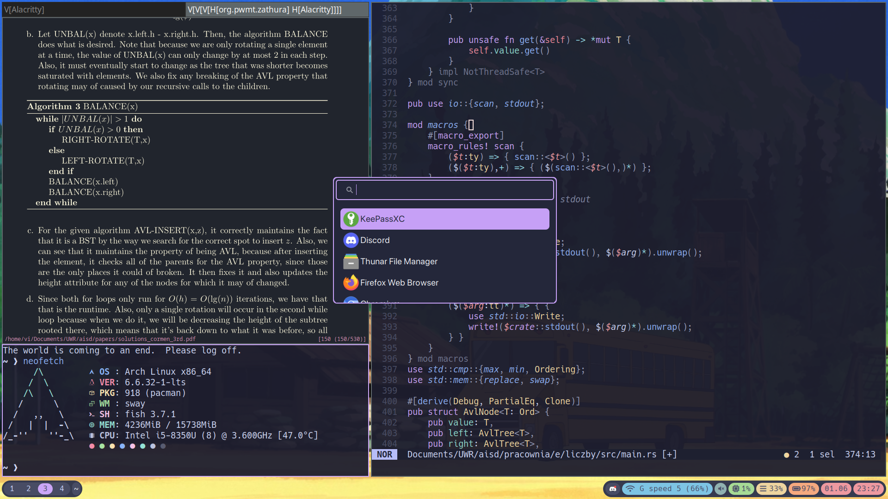

# dotfiles

dotfiles managed using a git bare repository, synced with github
using an alias (or rather a fish function) to easily edit and update when I need from commandline.

## Pretty picture:



## Why git bare?

After I nuked my install (happens) I thought It's a good idea to store my configs somewhere safe.
When I googled for solutions I only found enterprise grade programs or voodoo symlink stuff which I did't understand.\
Then I came across this [blog post](https://www.atlassian.com/git/tutorials/dotfiles) which handheld me for most of the way (damn you fish!).

## How to install?

### Step 1 - create alias: 
Paste this command into your shell's config file(eg. .bashrc or .zsh):
`alias config="/usr/bin/git --git-dir=$HOME/.cfg/ --work-tree=$HOME"`
If you use fish like me type `function config`, then enter then paste `/usr/bin/git --git-dir=$HOME/.cfg/ --work-tree=$HOME` then enter, type end and enter. Ith should look like this:

```fish
function config 
    /usr/bin/git --git-dir=$HOME/.cfg/ --work-tree=$HOME $argv
end
```
to make it persistent run `funcsave config`

### Step 2 - clone repo

since we're doing a bare repo, we should ignore git folder:
`echo ".cfg" >> .gitignore`

clone the repo:

`git clone --bare <git-repo-url> $HOME/.cfg`

# TODO finish readme
